# Customer Support Project - Beads Visual Overview

## 📊 Project Stats

- **Total Issues**: 56 (all closed ✓)
- **Avg Time to Close**: 1.3 hours
- **Closed Last 7 Days**: 56

## 🔑 Key Critical Tickets

### Top Bottlenecks (most dependencies flow through):
1. **bf5** - API Endpoints for Dev Task Management (28 dependencies)
2. **501** - Product Dashboard with Charts (10 deps)
3. **lqz** - Task Management UI (8 deps)
4. **1cv** - Developer Kanban Board (6 deps)
5. **1t4** - Permissions & Access Control (4 deps)

### Critical Path Keystones (failure would break multiple paths):
- **b3r** - Database Schema for Epics/Features/Tasks
- **bf5** - API Endpoints for Dev Task Management
- **1cv** - Developer Kanban Board

## 🌐 Dependency Graph (Mermaid)

**View this graph at:** https://mermaid.live

Copy the diagram below and paste into mermaid.live to see visual dependency tree:

```mermaid
graph TD
    classDef open fill:#50FA7B,stroke:#333,color:#000
    classDef inprogress fill:#8BE9FD,stroke:#333,color:#000
    classDef blocked fill:#FF5555,stroke:#333,color:#000
    classDef closed fill:#6272A4,stroke:#333,color:#fff

    customer-support-0ra["customer-support-0ra<br/>Create task_assignments junction table"]
    class customer-support-0ra closed
    customer-support-0so["customer-support-0so<br/>Create support_ticket_tasks link table"]
    class customer-support-0so closed
    customer-support-1cv["customer-support-1cv<br/>Developer Kanban Board (My Tasks)"]
    class customer-support-1cv closed
    customer-support-1mw["customer-support-1mw<br/>Implement GET /api/products/:id/dashb..."]
    class customer-support-1mw closed
    customer-support-1t4["customer-support-1t4<br/>Permissions & Access Control for Deve..."]
    class customer-support-1t4 closed
    customer-support-23q["customer-support-23q<br/>Implement GET /api/epics?productId en..."]
    class customer-support-23q closed
    customer-support-29j["customer-support-29j<br/>Implement GET /api/tasks/my-tasks end..."]
    class customer-support-29j closed
    customer-support-4f7["customer-support-4f7<br/>Implement GET /api/features?epicId en..."]
    class customer-support-4f7 closed
    customer-support-501["customer-support-501<br/>Product Dashboard with Charts"]
    class customer-support-501 closed
    customer-support-7bj["customer-support-7bj<br/>Add spawn task button to ticket detail"]
    class customer-support-7bj closed
    customer-support-8ok["customer-support-8ok<br/>Implement POST /api/features endpoint"]
    class customer-support-8ok closed
    customer-support-8xh["customer-support-8xh<br/>Implement epic progress chart"]
    class customer-support-8xh closed
    customer-support-9n1["customer-support-9n1<br/>Implement task status distribution chart"]
    class customer-support-9n1 closed
    customer-support-9og["customer-support-9og<br/>Build Epic→Feature→Task drilldown UI"]
    class customer-support-9og closed
    customer-support-9zw["customer-support-9zw<br/>Build /products/:id/dashboard page"]
    class customer-support-9zw closed
    customer-support-aty["customer-support-aty<br/>Internal Development Task Management ..."]
    class customer-support-aty closed
    customer-support-b3r["customer-support-b3r<br/>Database Schema for Epics/Features/Tasks"]
    class customer-support-b3r closed
    customer-support-bf5["customer-support-bf5<br/>API Endpoints for Dev Task Management"]
    class customer-support-bf5 closed
    customer-support-bny["customer-support-bny<br/>Add developer role to userRoles enum"]
    class customer-support-bny closed
    customer-support-c15["customer-support-c15<br/>Implement drag-drop for task cards"]
    class customer-support-c15 closed
    customer-support-cg5["customer-support-cg5<br/>Add requireDeveloper middleware"]
    class customer-support-cg5 closed
    customer-support-dwg["customer-support-dwg<br/>Run schema migration (db:push)"]
    class customer-support-dwg closed
    customer-support-ent["customer-support-ent<br/>Customer Support MVP"]
    class customer-support-ent closed
    customer-support-ent5["customer-support-ent.5<br/>Authentication System"]
    class customer-support-ent5 closed
    customer-support-ent51["customer-support-ent.5.1<br/>Setup User model with tenant_id"]
    class customer-support-ent51 closed
    customer-support-ent52["customer-support-ent.5.2<br/>Implement signup endpoint"]
    class customer-support-ent52 closed
    customer-support-ent53["customer-support-ent.5.3<br/>Implement signin endpoint"]
    class customer-support-ent53 closed
    customer-support-ent54["customer-support-ent.5.4<br/>Auth middleware"]
    class customer-support-ent54 closed
    customer-support-ent6["customer-support-ent.6<br/>Ticket Management"]
    class customer-support-ent6 closed
    customer-support-ent61["customer-support-ent.6.1<br/>Setup Ticket model"]
    class customer-support-ent61 closed
    customer-support-ent62["customer-support-ent.6.2<br/>Create ticket endpoint"]
    class customer-support-ent62 closed
    customer-support-ent63["customer-support-ent.6.3<br/>List my tickets endpoint"]
    class customer-support-ent63 closed
    customer-support-ent64["customer-support-ent.6.4<br/>View ticket detail endpoint"]
    class customer-support-ent64 closed
    customer-support-ent7["customer-support-ent.7<br/>Admin Dashboard"]
    class customer-support-ent7 closed
    customer-support-ent71["customer-support-ent.7.1<br/>Admin list all tickets"]
    class customer-support-ent71 closed
    customer-support-ent72["customer-support-ent.7.2<br/>Admin update ticket status"]
    class customer-support-ent72 closed
    customer-support-ent8["customer-support-ent.8<br/>Multi-tenant Setup"]
    class customer-support-ent8 closed
    customer-support-ent81["customer-support-ent.8.1<br/>Setup Tenant model"]
    class customer-support-ent81 closed
    customer-support-ent82["customer-support-ent.8.2<br/>Tenant middleware"]
    class customer-support-ent82 closed
    customer-support-f7d["customer-support-f7d<br/>Create features table schema"]
    class customer-support-f7d closed
    customer-support-fg7["customer-support-fg7<br/>Seed sample epics/features/tasks data"]
    class customer-support-fg7 closed
    customer-support-fqp["customer-support-fqp<br/>Build /developer/my-tasks Kanban boar..."]
    class customer-support-fqp closed
    customer-support-g7r["customer-support-g7r<br/>Implement POST /api/tasks/:id/assign ..."]
    class customer-support-g7r closed
    customer-support-gcm["customer-support-gcm<br/>Build Create Task form with multi-dev..."]
    class customer-support-gcm closed
    customer-support-gop["customer-support-gop<br/>Implement POST /api/tickets/:id/spawn..."]
    class customer-support-gop closed
    customer-support-kag["customer-support-kag<br/>Implement POST /api/tasks endpoint"]
    class customer-support-kag closed
    customer-support-lqz["customer-support-lqz<br/>Task Management UI (Create/Assign/Spawn)"]
    class customer-support-lqz closed
    customer-support-prc["customer-support-prc<br/>Build Create Epic form/modal"]
    class customer-support-prc closed
    customer-support-qus["customer-support-qus<br/>Implement role-based access for task ..."]
    class customer-support-qus closed
    customer-support-s3s["customer-support-s3s<br/>Build Create Feature form/modal"]
    class customer-support-s3s closed
    customer-support-tft["customer-support-tft<br/>Performance test"]
    class customer-support-tft closed
    customer-support-uck["customer-support-uck<br/>Create epics table schema"]
    class customer-support-uck closed
    customer-support-xvh["customer-support-xvh<br/>Implement burndown chart"]
    class customer-support-xvh closed
    customer-support-xy7["customer-support-xy7<br/>Build task detail modal"]
    class customer-support-xy7 closed
    customer-support-xzu["customer-support-xzu<br/>Create dev_tasks table schema"]
    class customer-support-xzu closed
    customer-support-yh5["customer-support-yh5<br/>Implement POST /api/epics endpoint"]
    class customer-support-yh5 closed

    customer-support-0ra ==> customer-support-b3r
    customer-support-0so ==> customer-support-b3r
    customer-support-1cv ==> customer-support-bf5
    customer-support-1mw ==> customer-support-bf5
    customer-support-1t4 ==> customer-support-bf5
    customer-support-23q ==> customer-support-bf5
    customer-support-29j ==> customer-support-bf5
    customer-support-4f7 ==> customer-support-bf5
    customer-support-501 ==> customer-support-bf5
    customer-support-7bj ==> customer-support-lqz
    customer-support-8ok ==> customer-support-bf5
    customer-support-8xh ==> customer-support-501
    customer-support-9n1 ==> customer-support-501
    customer-support-9og ==> customer-support-501
    customer-support-9zw ==> customer-support-501
    customer-support-bf5 ==> customer-support-b3r
    customer-support-bny ==> customer-support-b3r
    customer-support-c15 ==> customer-support-1cv
    customer-support-cg5 ==> customer-support-1t4
    customer-support-dwg ==> customer-support-b3r
    customer-support-ent5 -.-> customer-support-ent
    customer-support-ent51 -.-> customer-support-ent5
    customer-support-ent52 -.-> customer-support-ent5
    customer-support-ent53 -.-> customer-support-ent5
    customer-support-ent54 -.-> customer-support-ent5
    customer-support-ent6 -.-> customer-support-ent
    customer-support-ent61 -.-> customer-support-ent6
    customer-support-ent62 -.-> customer-support-ent6
    customer-support-ent63 -.-> customer-support-ent6
    customer-support-ent64 -.-> customer-support-ent6
    customer-support-ent7 -.-> customer-support-ent
    customer-support-ent71 -.-> customer-support-ent7
    customer-support-ent72 -.-> customer-support-ent7
    customer-support-ent8 -.-> customer-support-ent
    customer-support-ent81 -.-> customer-support-ent8
    customer-support-ent82 -.-> customer-support-ent8
    customer-support-f7d ==> customer-support-b3r
    customer-support-fg7 ==> customer-support-bf5
    customer-support-fqp ==> customer-support-1cv
    customer-support-g7r ==> customer-support-bf5
    customer-support-gcm ==> customer-support-lqz
    customer-support-gop ==> customer-support-bf5
    customer-support-kag ==> customer-support-bf5
    customer-support-lqz ==> customer-support-bf5
    customer-support-prc ==> customer-support-lqz
    customer-support-qus ==> customer-support-1t4
    customer-support-s3s ==> customer-support-lqz
    customer-support-uck ==> customer-support-b3r
    customer-support-xvh ==> customer-support-501
    customer-support-xy7 ==> customer-support-1cv
    customer-support-xzu ==> customer-support-b3r
    customer-support-yh5 ==> customer-support-bf5
```



## 🎯 How to View Visually

### Method 1: Mermaid Live (Easiest)
1. Copy the diagram code above (between ```mermaid markers)
2. Go to https://mermaid.live
3. Paste and view interactive diagram

### Method 2: VSCode (if you have Mermaid plugin)
1. Open this file in VSCode
2. Install "Markdown Preview Mermaid Support" extension
3. Preview this markdown file

### Method 3: Graphviz PNG
```bash
brew install graphviz
bv --robot-graph --graph-format=dot | dot -Tpng -o beads-graph.png
open beads-graph.png
```

### Method 4: Interactive TUI (Best for exploration)
```bash
bv                    # Launch viewer
# Press 'b' for Kanban
# Press 'g' for graph view
# Press 'i' for insights
# Press 'h' for git history
```

## 📈 Project Architecture Insights

**Foundation Layer** (must be done first):
- Database Schema (b3r)

**API Layer** (depends on DB):
- API Endpoints (bf5) ← Main bottleneck

**UI Layer** (depends on APIs):
- Product Dashboard (501)
- Developer Kanban (1cv)
- Task Management UI (lqz)

**Feature Modules**:
- MVP Epic (customer-support-ent) with Auth, Tickets, Admin, Multi-tenant

All 56 tickets completed! Nice clean dependency tree with no cycles.
